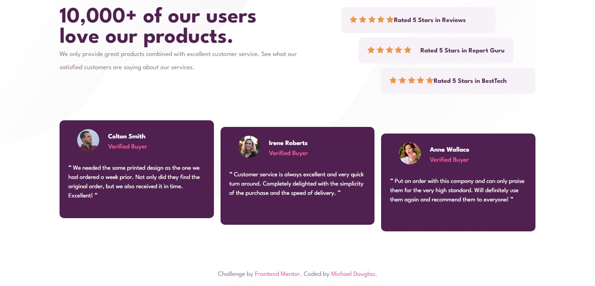

# Frontend Mentor - Social proof section solution

This is a solution to the [Social proof section challenge on Frontend Mentor](https://www.frontendmentor.io/challenges/social-proof-section-6e0qTv_bA). Frontend Mentor challenges help you improve your coding skills by building realistic projects.

## Table of contents

- [The challenge](#the-challenge)
- [Screenshot](#screenshot)
- [Links](#links)
- [My process](#my-process)
  - [Built with](#built-with)
  - [What I learned](#what-i-learned)
  - [Useful resources](#useful-resources)
- [Author](#author)

### The challenge

Users should be able to:

- View the optimal layout for the section depending on their device's screen size

### Screenshot



### Links

- Solution URL: [Add solution URL here](https://github.com/Miked0/Social-Proof-Section/)
- Live Site URL: [Add live site URL here](miked0-social-proof-section.vercel.app)

## My process

Foi difícil conseguir colocar os itens no posicionamento certo, porém com muita pesquisa no youtube/google, consegui achar alguns materiais e conteúdos que me ajudaram a solucionar o desafio.

Amo aprender coisas novas durante o desenvolvimento de algum projeto.

### Built with

- Semantic HTML5 markup
- CSS custom properties
- Flexbox
- CSS Grid
- Mobile-first workflow

### What I learned

```html
<h1>Códigos que eu fiquei feliz de aprender/ por em pratica</h1>
<p>flex-basis, grid layout e alinhamento com o CSS</p>
```

If you want more help with writing markdown, we'd recommend checking out [The Markdown Guide](https://www.markdownguide.org/) to learn more.

### Useful resources

- [CSS TRICK Layout Guide](https://css-tricks.com/snippets/css/complete-guide-grid/) - Sem esse site eu não teria conseguido finalizar o alinhamento dos itens do site. Sempre que preciso consultar as propriedades de GRID ou de FLEXBOX abro o site para consultar :))

## Author

- Website - [Add your name here](Miked0.github.io)
- Frontend Mentor - [@yourusername](https://www.frontendmentor.io/profile/Miked0)
- Twitter - [@yourusername](https://www.twitter.com/miiked0)
